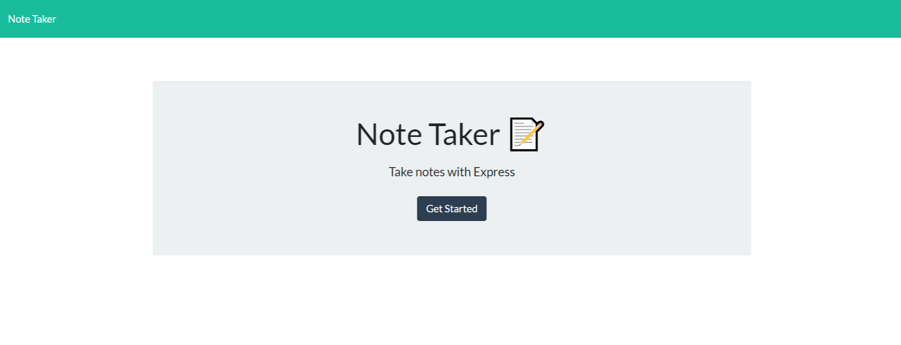
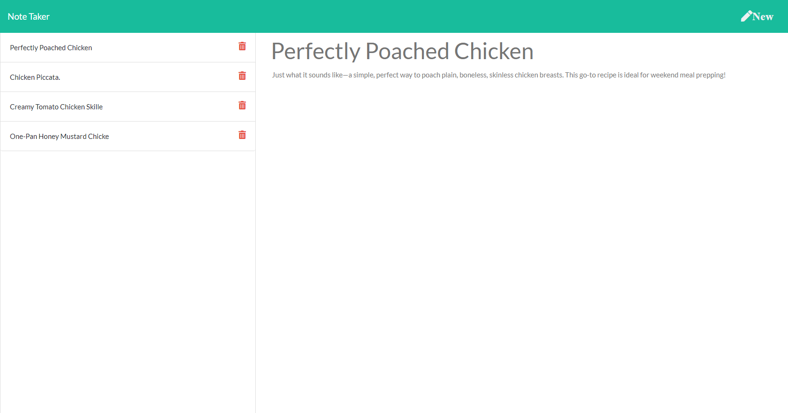

# Note Taker
## Task

Create an application that can be used to write, save, and delete notes. This application will use an express backend and save and retrieve note data from a JSON file.

The application will be invoked by using the following command:

```
node server.js
```
  ## Table of Contents

  1. [User Story](#user-story)
  2. [Business Context](#business-context)
  3. [Built With](#built-with)
  4. [How to Install](#how-to-install)
  5. [How to Use](#how-to-use)
  6. [Submission](#submission)
  7. [Example](#example)
  8. [Questions](#questions)

## User Story

```
AS A user, I want to be able to write and save notes
I WANT to be able to delete notes I've written before
SO THAT I can organize my thoughts and keep track of tasks I need to complete
```
## Business Context

For users that need to keep track of a lot of information, it's easy to forget or be unable to recall something important. Being able to take persistent notes allows users to have written information available when needed.

### Built With
----
```
  * Node.js
  * Javascript
  * Html
  * Jquery
  * Node Modules
    - express
```    
### How to Install
----
```
npm i
```

### How to Use
----
```
  1- Type "node server.js" in the console.
  2- Open the browser and go http://localhost:3000
  3- Click Get Started to start
  4- Click New in the top right to create new Notes everytime you need.
  5- After you have title and text in the note, you will see the save button.
  6- You can see old notes and delete them.

```    
### Submission
---

Github Repo URL: 
[https://github.com/v1zconde/note_taker](https://github.com/v1zconde/note_taker)

Deployed Heroku: 
[https://evening-wildwood-02150.herokuapp.com/](https://evening-wildwood-02150.herokuapp.com/)

How to use Video: 
[Watch Video](https://drive.google.com/file/d/1M3o9R62rXwYW22As0OcWVMFsSh6ZRhMw/view)

## Example
---
### Note Main

### Note Taker


  ## Questions
you have any questions about the repo, open an issue or contact me directly at rvasquez1@gmail.com. You can find more of my work at 
  Github: [v1zconde](http://github.com/v1zconde)

